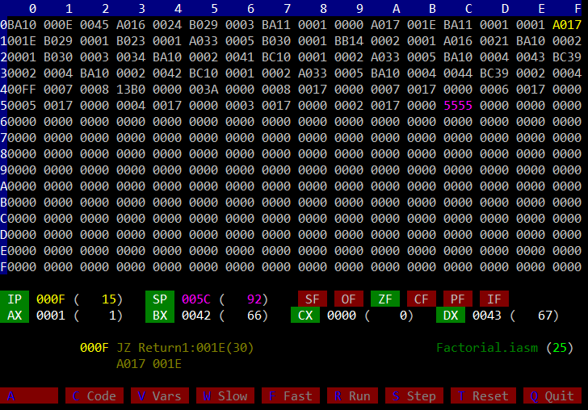

# IntMachine

A virtual computer/CPU written in python, with an assembler and debugger.

Has a 16 bit CPU with 4 all-purpose registers.

Assembly language based loosely on 8086.

Can use 64K 2-byte memory locations. 



## Usage

```
python Main.py <sourcefile> [--debug]
```
Example:
```
python Main.py programs/prog0.iasm --debug
```

Running without the debugger currently just runs the program and shows the variables and their final value.

## TODO

- Implement NOT
- Implement/Fix CF and OF
- Check setting of CPU Flags
- Test on Linux
- Test on Mac
- Scope variables to the file they are defined in

# Dependancies

None

# Compatibility

Tested with Python 3.7.0, but should also work with 3.5.0 and above.

Developed on Windows 10.

Runs in terminal (CMD.exe), powershell terminal and mintty (Git Bash).

Tested on a Raspberry PI 3B+ using PuTTY.

# Source Code

## Program.py

Contains:
- sourcecode
- preprocessor result
- assembler result, this is the intcode for the CPU

## Preprocessor.py

Preprocesses source files, preparing them for the assembler. This includes processing IMPORT statements.

## Assembler.py

Can convert preprocessed assembler code into intcode.

## Compiler.py

Not implemented yet

## Computer.py

Contains:
- Memory: 64K 2-byte words
- CPU

The computer can load a program into memory and use the CPU to execute it

## Cpu.py

Has access to the computers memory.

Can execute intcode instructions from memory.

## Label.py

Defines labels/variables.

## Instruction.py

Defines a CPU instruction.

## Parameter.py

Defines a patrameter to an instruction.

## Debugger.py

Displays memory contents, CPU registers and flags, current intruction and variables. 

Allows executing a program step by step.

## Definitions.py

Misc definitions used by all modules.

## Ansi.py

Used by the debugger to write to the screen.

## KeyGetter.py

Used by the debugger to process keystrokes.

# Assembly language

The CPU is loosely based on the 8086 and so are the mnemonics.

## Conventions

A program must have a label called Main. This is where execution will start.

A program must also have a variable called Stack. The stackpointer will be pointed to that variable when execution starts.

There is no guard against stack overflow, so make the stack large enough.

## Variables

The assembler currently supports 3 data types: word, byte and string.

Examples:

```
TheAnswer: 42, word[1]
Greeting: "Hello world", string[30]
OtherNumber: 7, byte[1]
Stack: 0x5555, word[32]
```

Currently there is no variable scope; all variables are global.

Variable names are truncated to 12 characters.

## Bootstrap

The assembler adds 2 instructions to the beginning of the program:

```
MOV SP, Stack   // Initialize the stackpointer
JMP Main        // Jump to Main
```

## Registers

IP : Instruction pointer

SP : Stack pointer

IX : Index register

AX

BX

CX

DX

## Flags

SF : Sign flag

OF : Overflow flag

ZF : Zero flag

CF : Carry flag

PF : Parity flag

IF : Interrupt flag (Not used yet)

## Instructions

#### JMP

Unconditional jump
```
JMP Labelname
```

#### MOV

Move values to registers
```
MOV AX, BX
MOV BX, 1234
MOV CX, 0xABBA
MOV DX, 0b11110000
MOV AX, [BX]
MOV BX, Labelname
```

#### STOR

Set memorylocation to a value

```
STOR 123, [AX]
STOR BX, [CX]
```

#### CALL

Calls a subroutine.

```
CALL Subroutine
```

#### RET

Return from a subroutine.

```
RET
```

#### PUSH

Push a value on the stack

```
PUSH AX
PUSH BX
```

#### POP

Pop  a value from the stack

```
POP BX
POP AX
```

#### PUSHF

Push the flags to the stack

```
PUSHF
```

#### POPF

Pop the flags from the stack

```
POPF
```

#### ADD

Addition. 
```
ADD AX, 7       // AX = AX + 7
ADD BX, CX      // BX = BX + AX
ADD CX, 0x10    // CX = CX + 16
```

#### SUB

Subtraction. 
```
SUB AX, 7       // AX = AX - 7
SUB BX, CX      // BX = BX - AX
SUB CX, 0x10    // CX = CX - 16
```

#### MUL

Multiplication. 
```
MUL AX, 7       // AX = AX * 7
MUL BX, CX      // BX = BX * AX
MUL CX, 0x10    // CX = CX * 16
```

#### DIV

Integer division. Remainder is in DX.
```
DIV AX, 7       // AX = AX / 7
DIV BX, CX      // BX = BX / AX
DIV CX, 0x10    // CX = CX / 16
CMP DX, 0
JZ NoRemainder
```

#### AND

Bitwise AND.
```
AND AX, 7
AND BX, CX
AND CX, 0b10101010
```

#### OR

Bitwise OR.
```
OR AX, 7
OR BX, CX
OR CX, 0b10101010
```

#### XOR

Bitwise XOR.
```
XOR AX, 7
XOR BX, CX
XOR CX, 0b10101010
```

#### NOT

#### DEC

Decrement.
```
DEC AX          // AX = AX - 1
```

#### INC

Increment.
```
INC BX          // BX = BX - 1
```

#### SHL

Bit shift left.
```
SHL AX
```

#### SHR

Bit shift right.
```
SHR BX
```

#### JZ

Jump if ZF is set.
```
CMP AX, 10
JZ Loop
```

#### JNZ

Jump if ZF is not set.
```
CMP AX, 10
JNZ Loop
```

#### JO

Jump if OF is set.
```
MUL AX, 10
JO Loop
```

#### JNO

Jump if OF is not set.
```
MUL AX, 10
JNO Loop
```

#### JC

Jump if CF is set.
```
ADD AX, 10
JC Loop
```

#### JNC

Jump if CF is not set.
```
ADD AX, 10
JNC Loop
```

#### JL

#### JLE

#### JG

#### JGE

#### NOP

No operation. Does nothing.

```
NOP
```

#### HLT

Halts the CPU.

```
HLT
```

## Addressing modes

### Direct 

The value for the parameter is provided in the instruction:

```
MOV AX, 5
MOV AX, 0xABBA
MOV BX, 0b10101010
MOV CX, Variablename
```

### Register

When the parameter is a register

```
MOV AX, BX
CMP AX, CX
NOT DX
```

### Reference

To reference memory, the address must be loaded in one of the registers, like so:

```
MOV AX, VariableName       // Loads the address of 'VariableName' in AX.
```

Then that memory location can be accessed:

```
MOV BX, [AX]              // Load the value at memorylocation [AX] in BX.
STOR CX, [AX]             // Store the value of CX at the memory location AX is pointing at.
```

### Indexed

```
MOV BX, [AX+IX]           // Load the value at memorylocation [AX+IX] in BX.
STOR CX, [AX+IX]          // Store the value of CX at the memory location AX+IX is pointing at.
```

# Roadmap

- Add support for floating point instructions.
- Add some kind of output device.
- Add support for input.
- Write a library with common functions.
- Add a compiler that can compile (transpile ?) a higher level language to assembly sourcecode.
